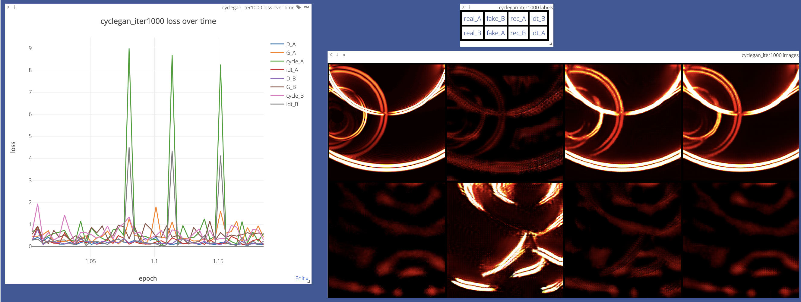

# luvt-cyclegan
## datasetの置き方
- 以下に構造を示します．
```
datasets/
├── combine_A_and_B.py
├── download_cyclegan_dataset.sh
├── download_pix2pix_dataset.sh
├── luvt
│   ├── trainA
│   │   ├── 00000.png
│   │   ├── 00001.png
│   │   ├── 00002.png
│   │   ├── ...
│   │   ├── 23701.png
│   │   ├── 23702.png
│   │   ├── 23703.png
│   │   └── 23704.png
│   └── trainB
│       ├── 00000.png
│       ├── 00001.png
│       ├── 00002.png
│       ├── ...
│       ├── 18877.png
│       └── 18878.png
├── make_dataset_aligned.py
└── prepare_cityscapes_dataset.py
```
- luvt/trainAに人工LUVT画像群，luvt/trainBに実LUVT画像群を置いてください．
- 実画像は時系列画像の冒頭40枚削ったものを使いました．
- NASのリンクを別途添付するので，そこからデータをダウンロードしてください． 
- 元の画像とナンバリングとの対応はNASリンク内のpath.csvを参照してください．
## 実行
- 基本的にはsrcの中にあるimplement.shを実行すればOKです．
  - 実行時の引数は，options以下のpythonファイルを参照してください．
  - checkpointsフォルダが自動的に作成され，情報が保存されていきます．
- 最大のepoch数は2にしてあります．
  - 反復数は短めのほうがスタイル変換が定性的にうまくできていると思います．
- リアルタイムで損失関数や画像の学習中の様子を観察できます（vscodeでportを開く作業が必要）．

  - 左が損失関数，右が結果の一部
  - fakeB（1行目2列目）がシミュレーション画像をスタイル変換した画像．
- testが実行されると，resultsフォルダに結果が保存されます．
## 環境構築
### dockerを使う場合
- docker/Dockerfileをご利用ください．
### 手動で入れる場合
- Pythonのバージョンは3.8.8です．
- 依存しているパッケージを以下に示します．
```
absl-py                 1.2.0
aiohttp                 3.8.1
aiosignal               1.2.0
argon2-cffi             21.3.0
argon2-cffi-bindings    21.2.0
asttokens               2.0.8
async-timeout           4.0.2
attrs                   22.1.0
backcall                0.2.0
beautifulsoup4          4.9.3
bleach                  5.0.1
brotlipy                0.7.0
cachetools              5.2.0
certifi                 2020.12.5
cffi                    1.14.3
chardet                 3.0.4
charset-normalizer      2.1.1
click                   8.1.3
cloudpickle             2.2.0
colorama                0.4.5
commonmark              0.9.1
conda                   4.9.2
conda-build             3.21.4
conda-package-handling  1.7.2
cryptography            3.2.1
cycler                  0.11.0
debugpy                 1.6.3
decorator               4.4.2
defusedxml              0.7.1
dnspython               2.1.0
docker-pycreds          0.4.0
dominate                2.7.0
entrypoints             0.4
executing               1.0.0
fastjsonschema          2.16.1
filelock                3.0.12
frozenlist              1.3.1
fsspec                  2022.8.2
future                  0.18.2
gensim                  4.2.0
gitdb                   4.0.9
GitPython               3.1.27
glob2                   0.7
google-auth             2.11.0
google-auth-oauthlib    0.4.6
grpcio                  1.48.1
idna                    2.10
imageio                 2.18.0
importlib-metadata      4.12.0
importlib-resources     5.9.0
ipykernel               6.15.2
ipython                 8.5.0
ipython-genutils        0.2.0
ipywidgets              8.0.2
jedi                    0.17.0
Jinja2                  3.1.2
joblib                  1.1.0
jsonpatch               1.32
jsonpointer             2.3
jsonschema              4.15.0
jupyter                 1.0.0
jupyter_client          7.3.5
jupyter-console         6.4.4
jupyter-core            4.11.1
jupyterlab-pygments     0.2.2
jupyterlab-widgets      3.0.3
kiwisolver              1.4.4
libarchive-c            2.9
llvmlite                0.36.0
lxml                    4.9.1
Markdown                3.4.1
MarkupSafe              2.1.1
matplotlib              3.4.0
matplotlib-inline       0.1.6
mistune                 2.0.4
mkl-fft                 1.3.0
mkl-random              1.1.1
mkl-service             2.3.0
multidict               6.0.2
nbclient                0.6.7
nbconvert               7.0.0
nbformat                5.4.0
nest-asyncio            1.5.5
notebook                6.4.12
numba                   0.53.0
numpy                   1.22.0
oauthlib                3.2.0
olefile                 0.46
opencv-contrib-python   4.5.5.64
opencv-python           4.5.5.64
packaging               21.3
pandas                  1.4.0
pandocfilters           1.5.0
parso                   0.8.1
pathtools               0.1.2
pexpect                 4.8.0
pickleshare             0.7.5
Pillow                  8.3.2
pip                     22.2.2
pkginfo                 1.7.0
pkgutil_resolve_name    1.3.10
plotly                  5.7.0
prettytable             2.1.0
prometheus-client       0.14.1
promise                 2.3
prompt-toolkit          3.0.8
protobuf                3.19.4
psutil                  5.8.0
ptyprocess              0.7.0
pure-eval               0.2.2
pyasn1                  0.4.8
pyasn1-modules          0.2.8
pycosat                 0.6.3
pycparser               2.20
pyDeprecate             0.3.1
Pygments                2.8.0
pyOpenSSL               19.1.0
pyparsing               3.0.9
pyrsistent              0.18.1
PySocks                 1.7.1
python-dateutil         2.8.2
python-etcd             0.4.5
pytorch-lightning       1.5.10
pytz                    2021.1
PyYAML                  5.4.1
pyzmq                   23.2.1
qtconsole               5.3.2
QtPy                    2.2.0
requests                2.24.0
requests-oauthlib       1.3.1
rich                    12.4.4
rsa                     4.9
ruamel_yaml             0.15.87
scikit-learn            1.1.2
scipy                   1.8.0
seaborn                 0.11.1
semantic-version        2.10.0
Send2Trash              1.8.0
sentry-sdk              1.9.0
setproctitle            1.3.2
setuptools              59.5.0
setuptools-rust         1.3.0
shap                    0.41.0
shortuuid               1.0.9
six                     1.15.0
slicer                  0.0.7
smart-open              6.1.0
smmap                   5.0.0
soupsieve               2.2
stack-data              0.5.0
tenacity                8.0.1
tensorboard             2.10.0
tensorboard-data-server 0.6.1
tensorboard-plugin-wit  1.8.1
tensorboardX            2.4.1
terminado               0.15.0
threadpoolctl           3.1.0
timm                    0.6.7
tinycss2                1.1.1
torch                   1.8.1
torchelastic            0.2.2
torchfile               0.1.0
torchmetrics            0.9.3
torchsummary            1.5
torchtext               0.9.1
torchvision             0.9.1
tornado                 6.2
tqdm                    4.63.0
traitlets               5.3.0
typing_extensions       4.3.0
urllib3                 1.25.11
visdom                  0.1.8.9
wandb                   0.13.2
wcwidth                 0.2.5
webcolors               1.8
webencodings            0.5.1
websocket-client        1.4.1
Werkzeug                2.2.2
wheel                   0.37.1
widgetsnbextension      4.0.3
yarl                    1.8.1
zipp                    3.8.1
```
## 元のGitHub
- その他疑問あれば，[元のGithub](https://github.com/junyanz/pytorch-CycleGAN-and-pix2pix)のissue参考にしてください．
- 別のデータのダウンロードして，CycleGAN以外にもpix2pix等も試せます．